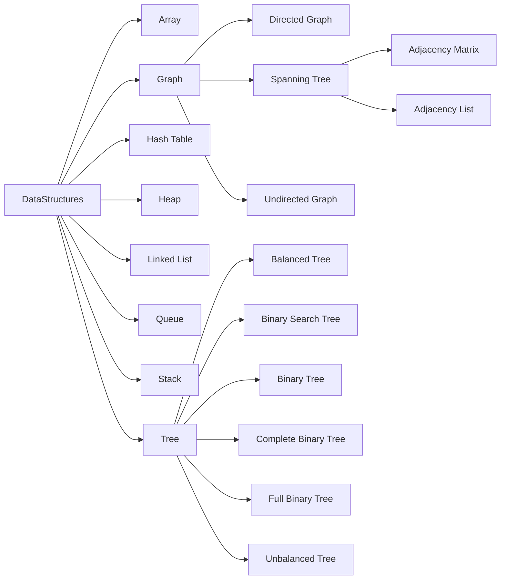

# DataStructures Study Index
---

---

## DataStructures
* ### Array
* ### Graph
  * #### Directed Graph
  * #### Spanning Tree
    * ##### Adjacency Matrix
    * ##### Adjacency List
  * #### Undirected Graph
* ### Hash Table
* ### Heap
* ### Linked List
* ### Queue
* ### Stack
* ### Tree
  * #### Balanced Tree
  * #### Binary Search Tree
  * #### Binary Tree
  * #### Complete Binary Tree
  * #### Full Binary Tree
  * #### Unbalanced Tree