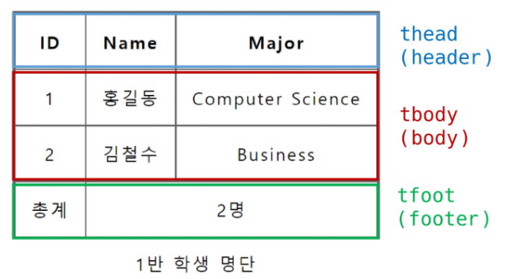
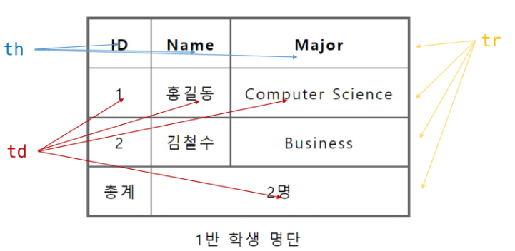
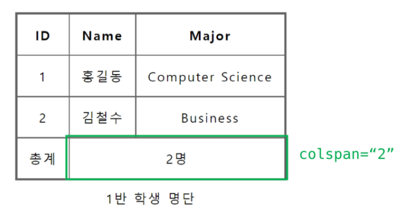
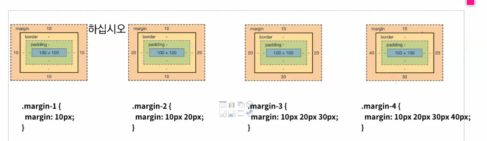
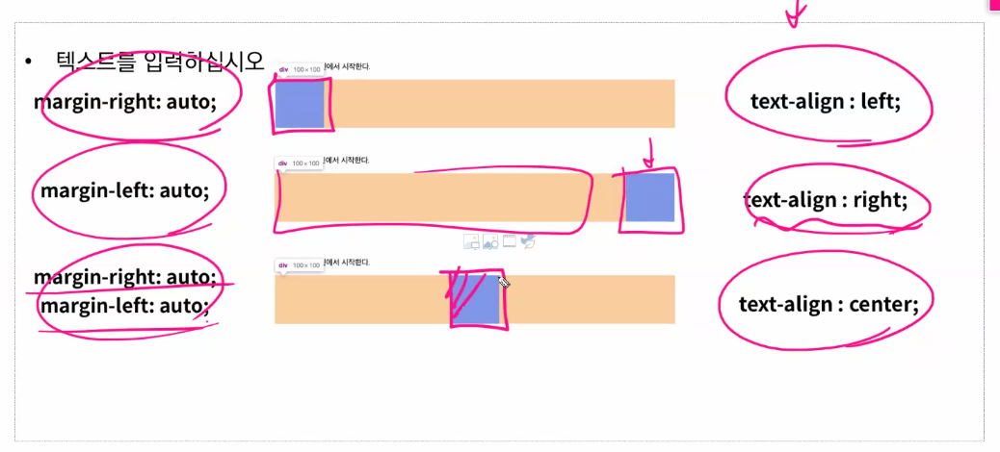

# 02 / 03

## HTML / CSS

### web programming

#### front-end

* **눈에 보이는 화면**을 만듬

---

##### HTML(Hyper Text Markup Language) : 웹 페이지 구조 생성

* **웹 브라우저**를 만드는 도구

* 언어가 아닌 **마크업 언어**의 일종

* 검색할 때는 **mdn** 을 앞에 붙이고 검색하자
* **w3school** 을 많이 이용하자

* **Tag 로 데이터와 문서의 구조**를 표현

* 확장자는 **.html**

* **DOM 트리** : **HTML 문서에 대한 모델**을 구성

  ​					 각 요소에 **접근 / 수정**에 용이

* **태그와 내용**으로 구성, **\<태그>내용\</태그>**
* **br, hr, img, input, link, meta** 는 내용이 없음
* 요소는 **중첩 가능**
* 오류는 반환되지 않고 **깨져서 출력**, **디버깅이 어려움**
* 태그별로 사용할 수 있는 **속성이 다름**
* **\<태그 속성="속성명">  ~ </태그>**

###### 기본 구조

* **html** : 문서의 **최상위 요소**

* **head** : 문서 **메타데이터 요소**

  ​            **문서 제목, 인코딩, 스타일, 외부 파일 로딩** 등

  ​            일반적으로 **브라우저에 나타나지 않는 내용**

* **body** : 문서 **본문 요소**

  ​			**실제 화면 구성**과 관련된 내용

###### HTML Global Attribute

* **모든 HTML 요소가 공통**으로 사용 가능한 대표적인 속성
* **id** : **문서 전체에서 유일**한 고유 식별자 지정
* **class** : **공백으로 구분**된 해당 요소의 클래스의 목록
* **data-\*** : 페이지에 **개인 사용자 정의 데이터를 저장**하기 위해 사용
* **style** : **inline 스타일**
* **title** : 요소에 대한 **추가 정보 지정**
* **tabindex** : 요소의 **탭 순서**

###### 시맨틱 태그

* **의미론적 요소**를 담은 태그
* **header** : 문서 전체나 섹션의 **헤더**
* **nav** : 내비게이션
* **aside** : **사이드**에 위치한 공간
* **section** : 문서의 **일반적인 구분**
* **article** : 문서, 페이지, 사이트 안에서 **독립적으로 구분**
* **footer** : 문서 전체나 섹션의 **푸터**
* **검색엔진최적화**를 위해 활용

###### 텍스트 요소

* **\<a>** : **href 속성**을 활용하여 **하이퍼링크 생성**

* **\<b>, \<strong>**: **굵은 글씨** 요소

* **\<i>** : **기울임 글씨** 요소
* **\ ** : **줄 바꿈 생성, 닫음 없음**
* **\** : **src 속성을 활용하여 이미지 표현, 닫음 없음**
* **\** : **인라인** 컨테이너

###### 그룹 컨텐츠

* **\
 **: **하나의 문단, 줄바꾸기 자동적용 안됨**, **인라인 요소**만 들어감

* **\
** : **수평선**

* **\<ol>, \<ul>** : **순서가 있는 리스트, 순서가 없는 리스트**

- **\<pre> **: HTML에 작성한 내용 **그대로 표현**, 많이 안씀

* **\<blockquote>** : **텍스트가 긴 인용문, 들여쓰기**로 표현

* **\
** : **블록 컨테이너**

###### table

* **\<thead> \<tbody> \<tfoot>** 요소를 활용

  

- **\<tr> 로 가로줄**을 구성하고 **\<th> 혹은 \<td>로 셀**을 구성

- **colspan, rowspan 속성을 활용**하여 셀 병합

  

###### form

* **서버에 데이터를 제출**하기 위한 영역
* **action : form** 을 처리할 **서버의 URL**
* **method** : **form 을 제출**할 때 사용할 **HTTP 메서드** (GET 혹은 POST)

###### input

* **다양한 타입**을 가지는 **입력 데이터 유형과 위젯**이 제공
* **name** : form control 에 **적용되는 이름**
* **value** : form control에 **적용되는 값**
* **label** : label을 클릭하여 input 자체의 초점을 맞추거나 활성화 시킬 수 있음
* **\<input>에 id 속성**을, **\<label>에는 for 속성**을 활용하여 **상호 연관**을 시킴
* **text : 일반 텍스트** 입력
* **password** : 입력시 **값이 보이지 않고 문자를 특수기호**로 표현
* **email** : 이메일 형식이 아닌 경우 **form 제출 불가**
* **number** : **min, max, step 속성**을 활용하여 **숫자 범위 설정 가능**
* **file** : **accept 속성**을 활용하여 **파일 타입 지정** 가능
* **checkbox** : **다중 선택**
* **radio** : **단일 선택**
* **color** : **색상 고르기**
* **date** : **날짜 고르기**
* **hidden** : **사용자에게 보이지 않는 input**

---

##### CSS : 웹 페이지 스타일링

* **선택**하고 **스타일을 지정**함

* **선택자{선언; **

  ​            **속성: 값;**

  **}**

* https://csslayout.io/ <- 유용..
* https://mybrandnewlogo.com/ko/color-gradient-generator <- 여기도..
* **인라인** : **html 코드와 같이 씀**
* 일반적으로 **id 는 한개만 존재**

###### 선택자

* **전체 선택자 : \***
* **요소 선택자 : h1, ....**
* **클래스 선택자 : . class Name{}**
* **아이디 선택자 : # id_name{}**
* **속성 선택자 : 속성과 속성값이 정확히 일치하는 요소 선택**

###### 결합자

* **자손 결합자 : A B**
* **자식 결합자 : A>B**
* **일반 형제 결합자 : A~B**
* **인접 형제 결합자 : A+B**

###### 동적 의사 클래스
- **:link** : 사용자가 아직 한 번도 해당 링크를 누르지 않은 상태 ( a요소 기본 )
- **:visited** : 사용자가 한 번이라도 해당 링크를 누른 상태
- **:hover** : 사용자의 마우스 커서가 위에 올라가 있는 상태
- **:active** : 사용자의 마우스 커서가 클릭중인 상태
- **:focus** : tab키로 focus가 맞춰진 상태
###### 상태 의사 클래스
- **:checked** : input의 checkbox나 raidobutton이 체크된 상태
- **:enabled** : input의 "type=text", select, option에서 사용자가 선택한 상태

- **:disabled** : input의 "type=text", select, option을 사용자가 선택할 수 없도록 만든 상태

###### 구조 의사 클래스
- **:first-child** : 모든 자식 요소 중에서 첫 번째에 위치하는 자식을 선택
- **:nth-child(n)** : 모든 자식 요소 중에서 n번째에 위치하는 자식을 선택
- **:last-child** : 모든 자식 요소 중에서 마지막에 위치하는 자식을 선택
- **:first-of-type** : 모든 자식 요소 중에서 첫 번째에 등장하는 특정 요소를 선택
- **:nth-of-type(n)** : 모든 자식 요소 중에서 n번째로 등장하는 특정 요소를 선택
- **:last-of-type** : 모든 자식 요소 중에서 마지막으로 등장하는 특정 요소를 선택

###### 가상 선택자

- **::first-letter** : 요소의 텍스트에서 첫 번째 글자에 스타일을 적용한다.블록타입의 요소에만 사용 가능
- **::first-line** : 요소의 텍스트에서 첫 줄에 스타일을 적용한다.블록타입의 요소에만 사용 가능
- **::before** : 요소의 콘텐츠 시작부분에 생성된 콘텐츠를 추가
- **::after** : 요소의 콘텐츠 끝부분에 생성된 콘텐츠를 추가

###### 우선순위

1. **중요도 : !important**
2. **우선순위 : 인라인 > id > class, 속성, pseudo-class > 요소, pseudo-element**
3. **CSS 파일 로딩 순서 : 가장 마지막에 정의된 문장을 따라감**

###### 상속

* CSS는 **상속을 통해 부모 요소의 속성을 자식에게 상속**함
* 속성 중에는 **상속이 되는 것과 되지 않는 것**들이 있음 
* https://www.w3.org/TR/CSS21/propidx <- 상속 확인표
* **inherit 키워드를 통해 상속** 가능

###### 크기 단위

* **고정 크기 단위** : **px**, 모니터 해상도의 픽셀 기준
* **가변 크기 단위** :**%**, 백분율 단위, 가변적인 레이아웃에서 자주 사용
* **em** : **부모의 상속의 영향**을 받음, **1em = 부모 요소 크기의 100%**
* **rem** : **부모의 상속의 영향을 받지 않음**, **최상위 요소의 사이즈**를 기준
* **viewport** : **vw, vh, vmin, vmax**, 웹페이지를 방문한 유저에게 바로 보이는 **웹 컨텐츠의 영역**

###### 색상단위

* **색상 키워드** : **대소문자를 구별하지 않고** 특정 색을 **직접 글자**로 나타냄
* **RGB 색상** : **16진수 표기법** 혹은 **함수형 표기법**을 사용해서 특정 색을 표현
* **HSL 색상** : **색상, 채도, 명도**를 통해 특정 색을 표현
* **a** 는 **투명도**

###### 박스 모델

* 모든 요소는 **박스모델**이고 **위에서 아래로 왼쪽에서 오른쪽**으로 쌓임

* 하나의 박스는 네 부분으로 이루어짐

  **content** : 글이나 이미지 등 **실제 내용**이 담겨있는 부분

  **padding** : **content 와 border 사이**의 공간, **요소에 담긴 배경색, 이미지는 padding 까지** 적용

  **border** : **테두리 영역**

  **margin** : **요소와 요소사이**의 거리

  

  

###### CSS 디스플레이

* **display 에 따라 박스모델의 크기와 배치**가 달라짐

* **diplay : block**

  ​			 **줄 바꿈**이 일어나는 요소

  ​		 	**화면 크기 전체**의 가로 폭을 차지함

  ​			 **블록 레벨 요소안에 인라인 레벨 요소**가 들어갈 수 있음

  ​			 **div, p, form 등..**

* **display : inline**

​						**줄 바꿈이 일어나지 않는** 행의 일부

​						**content 너비만큼 가로 폭**을 차지

​						**width, height, margin 등을 지정 못함**

​						**상하 여백은 line-height**로 지정

​						**span, a, img, input 등...**

* **display : inline-block**

  ​				**block과 inline 레벨 요소의 특징**을 모두 가짐

  ​				**inline처럼 한줄에 표시 가**하고 **block처럼 width height margin 속성을 모두 지정** 가능

* **display : none**

​		      		 **해당 요소를 화면에 표시하지 않고 공간조차 부여하지 않음**

​					    **visibility:hidden** 은 **공간은 차지하지만 표시만 하지 않음**

###### CSS Position

* **문서 상에서 요소의 위치**를 지정
* 모든 태그의 **기본값은 static**
* **일반적인 요소의 배치 순서**에 따름
* **부모 요소 내에서 배치**될때는 **부모 요소의 위치를 기준**으로 배치됨
* **relative, absolute, fixed** 를 통해 **top, bottom, left, right** 로 이동 가능
* **relative : 상대 위치**, 자기 자신의 **static 위치를 기준**으로 이동
* **absolute : 절대 위치**, **일반적인 문서 흐름에서 제거 후 레이아웃에 공간을 차지하지 않음**
* **fixed : 고정 위치**, **요소를 일반적인 문서 흐름에서 제거 후 레이아웃에서 공간을 차지하지 않음**

​				   **부모 요소와 관계없이 viewport를 기준**으로 이동, **스크롤 시에도 항상 같은 곳**에 위치

---

##### JS : 웹 페이지 기능 추가

---

#### back-end

* 데이터와 로직을 담당함

---